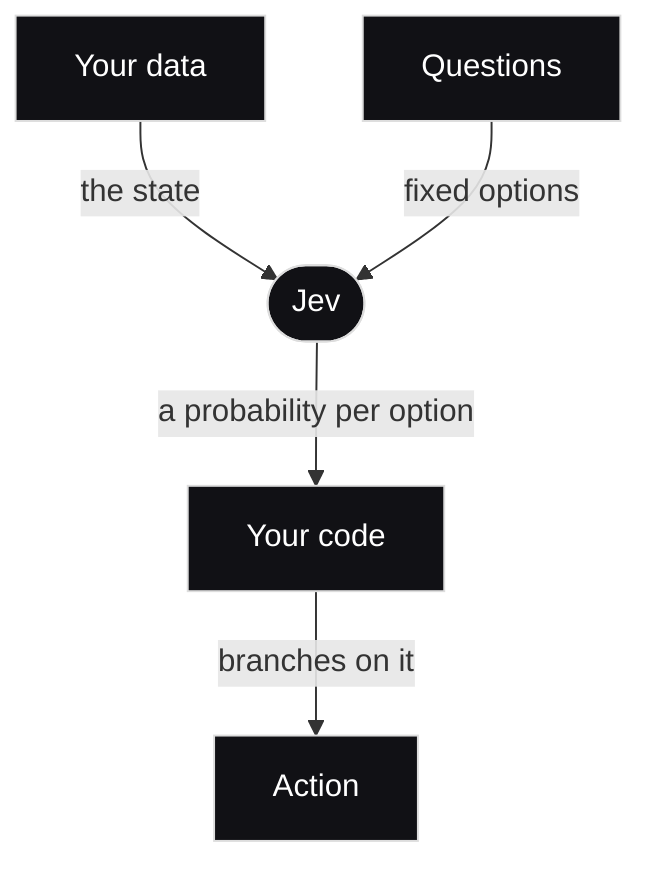
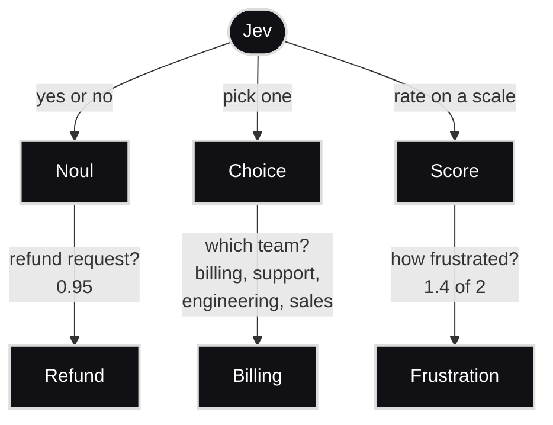
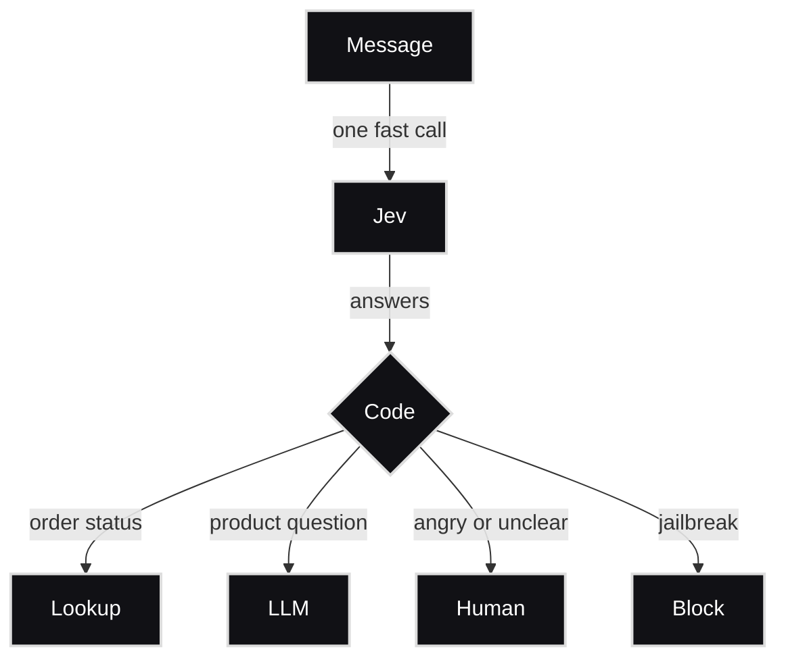

# Jev Decision Model — Mermaid Diagrams

## 1. From data and questions to action

```mermaid
flowchart TD
    A["Your data"] -->|the state| C(["Jev"])
    B["Questions"] -->|fixed options| C
    C -->|"a probability per option"| D["Your code"]
    D -->|"branches on it"| E["Action"]

    style A fill:#111115,stroke:#ddd,color:#fff
    style B fill:#111115,stroke:#ddd,color:#fff
    style C fill:#111115,stroke:#ddd,color:#fff
    style D fill:#111115,stroke:#ddd,color:#fff
    style E fill:#111115,stroke:#ddd,color:#fff
```

## 2. Question types and results

```mermaid
flowchart TD
    A(["Jev"])

    A -->|"yes or no"| B["Noul"]
    A -->|"pick one"| C["Choice"]
    A -->|"rate on a scale"| D["Score"]

    B -->|"refund request?<br/>0.95"| E["Refund"]
    C -->|"which team?<br/>billing, support,<br/>engineering, sales"| F["Billing"]
    D -->|"how frustrated?<br/>1.4 of 2"| G["Frustration"]

    classDef node fill:#111115,stroke:#ddd,color:#fff,stroke-width:2px
    class A,B,C,D,E,F,G node
```

## 3. Routing a message to the right action

```mermaid
flowchart TD
    A["Message"] -->|"one fast call"| B["Jev"]
    B -->|"answers"| C{"Code"}

    C -->|"order status"| D["Lookup"]
    C -->|"product question"| E["LLM"]
    C -->|"angry or unclear"| F["Human"]
    C -->|"jailbreak"| G["Block"]

    classDef node fill:#111115,stroke:#ddd,color:#fff,stroke-width:2px
    class A,B,C,D,E,F,G node
```
